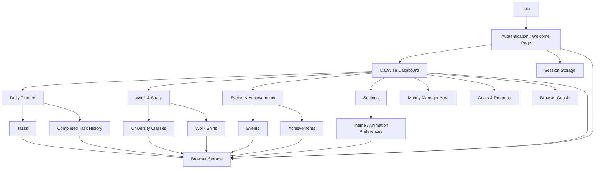
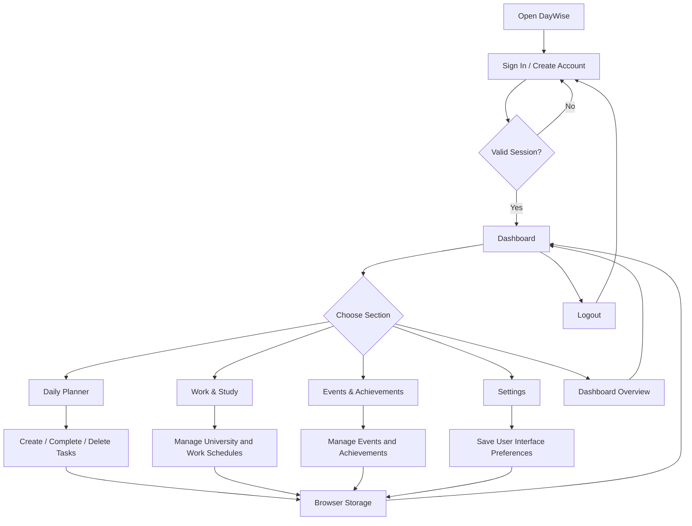
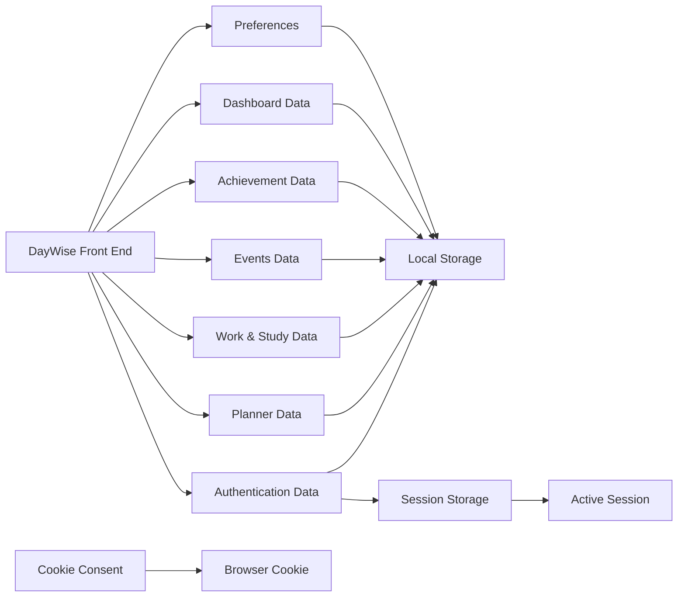
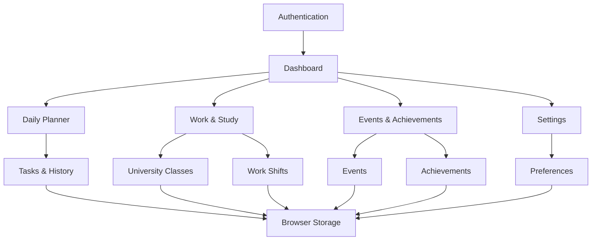

DayWise

Client-Side Life Management Web Application

DayWise is a browser-based client-side web application designed to help users organise and manage different areas of their daily life from one place.

The project brings together:

User registration and sign-in

A central dashboard

Daily task planning

Work and university scheduling

Events and achievements

Progress tracking

Settings and appearance preferences

Browser-based data persistence

Notifications and motivational feedback

The project is implemented as a front-end application using HTML, CSS and JavaScript. It does not contain a server-side backend or external database.

Project Purpose

DayWise is designed around the idea of keeping important daily activities in one organised system.

Instead of managing university work, employment shifts, tasks, events and achievements separately, the application provides dedicated sections that can be accessed from a central dashboard.

The main goals of the project are to:

Provide a clear and simple daily management interface.

Allow users to record and manage university and work schedules.

Help users create and track daily tasks.

Allow events and achievements to be recorded and completed.

Present progress information through the dashboard.

Store relevant information directly in the browser.

Provide a responsive interface suitable for different screen sizes.

Main Features

1. User Authentication and Welcome Page

The webpage section provides the main DayWise sign-in and account interface.

It includes:

Sign-in form

Account creation

Password confirmation during registration

Password reset interface

Remember-me preference

Login validation

Session creation

Logout functionality

User welcome information

Interactive slideshow introducing DayWise features

Animated visual elements

Toast and validation messages

For this client-side coursework project, user information and session information are handled in browser storage. This is a front-end demonstration rather than production-grade authentication.

Passwords are processed with the browser's SHA-256 Web Crypto functionality before being stored by the front-end authentication demonstration.

2. Dashboard

The dashboard acts as the main navigation and overview area of DayWise.

It provides access to the main sections of the application:

Daily Planner

Work & Study

Money Manager area

Events & Achievements

Goals and progress information

The dashboard also includes:

Welcome greeting

Current day, date and time

Quick-action navigation

Progress information

Event and achievement summaries

Dashboard counters

Theme handling

Cookie consent handling

Notifications

Motivational messages

Logout

The dashboard uses stored dashboard data to populate its overview values.

Dashboard Data

The current dashboard JavaScript contains stored overview values for:

Planner activity

Completed tasks

Achievements

Events

Savings

Previous-week progress

Current-week progress

The dashboard also calculates a weekly progress percentage from the available dashboard values.

3. Daily Planner

The Daily Planner is located inside the dayplanner folder.

It allows users to create and manage daily tasks.

Each task can contain:

Task title

Subject

Priority

Start time

End time

Deadline

Completion status

Task Management

The planner supports:

Adding tasks

Displaying active tasks

Completing tasks

Deleting tasks

Moving completed tasks into history

Displaying completion history

Calculating daily progress

Saving tasks in browser Local Storage

Loading saved tasks when the page opens

Progress Tracking

The planner calculates progress from active and completed tasks.

Completed tasks are moved to the task history and the progress indicator is updated automatically.

4. Work & Study Planner

The Work & Study section combines university scheduling and employment scheduling.

It contains two main areas:

University Classes

Users can add:

Module name

Lecturer

Day

Start time

End time

Room number

University classes are displayed in the university schedule.

Work Shifts

Users can add:

Company name

Job role

Work day

Start time

End time

Location

The application calculates the duration of a work shift from its start and end times.

Work & Study Dashboard

The section displays:

Number of university classes

Number of work shifts

Total working hours

A reminder based on the stored university schedule

Data Management

The Work & Study module supports:

Creating university records

Viewing university records

Deleting university records

Creating work-shift records

Viewing work-shift records

Deleting work-shift records

Automatic dashboard updates

Browser Local Storage persistence

Delete confirmation messages

Editing existing records is not implemented in the current files.

5. Events

The Events section allows users to create and manage personal events.

Each event contains:

Event title

Event date

Completion status

Unique identifier

The current implementation supports:

Adding events

Displaying events

Completing events

Deleting events

Saving events to Local Storage

Updating event statistics

The overview page can display the total number of events and the number of completed events.

6. Achievements

The Achievements section allows users to record achievements and track their completion.

Each achievement contains:

Achievement title

Description

Completion status

Unique identifier

The current implementation supports:

Adding achievements

Displaying achievements

Completing achievements

Deleting achievements

Saving achievements to Local Storage

Calculating achievement completion percentage

The overview section uses achievement information to display total achievements and completion progress.

7. Events & Achievements Overview

The project includes a dedicated overview page for events and achievements.

It provides summary information including:

Total events

Completed events

Total achievements

Achievement completion rate

This creates a simple progress overview without requiring a separate database.

8. Settings

The Settings page provides user interface preferences and project information.

Current settings include:

Animations

Users can enable or disable interface animations.

The selected animation preference is stored in Local Storage so the preference can be retained in the browser.

About Us

The Settings page also contains an expandable About Us section that can be shown or hidden by the user.

9. Theme and Appearance

DayWise contains theme-related functionality.

The dashboard JavaScript supports:

Light theme state

Dark theme state

Saving the selected theme in Local Storage

Loading the saved theme when the dashboard starts

The project also contains dedicated theme-related CSS files.

The Settings page additionally provides animation preferences.

10. Notifications and Feedback

Several areas of the application provide user feedback.

Examples include:

Form validation messages

Event and achievement confirmation messages

Delete notifications

Dashboard notifications

Motivational messages

Login and account messages

Toast notifications

The dashboard also displays an automatically generated motivational message after the page loads.

11. Browser Data Storage

DayWise is a client-side application, so browser storage is used instead of a server-side database.

The project uses:

Local Storage

Local Storage is used for several parts of the application, including:

User information in the front-end authentication demonstration

Persistent login session when the user chooses to remember the session

Daily planner tasks

Daily planner history

University classes

Work shifts

Events

Achievements

Dashboard data

Theme preference

Animation preference

Session Storage

Session Storage is used by the authentication flow for a non-persistent login session.

The dashboard also clears session storage during logout.

Cookies

The dashboard contains cookie-consent functionality.

A cookie is used to remember that cookie consent has been accepted for a defined period.

System Architecture

The following architecture represents the actual organisation of the DayWise project in the uploaded project files.

## System Architecture

## Application Flow

## Data Architecture

## Module Relationship

Technology Stack

HTML5

HTML provides the structure for the DayWise pages and forms.

It is used for:

Navigation

Forms

Dashboard cards

Tables

Task cards

Event and achievement cards

Buttons

Settings controls

Authentication interfaces

CSS

CSS provides the visual presentation of the application.

It is used for:

Layouts

Responsive grids

Cards

Forms

Tables

Buttons

Typography

Themes

Transitions

Animations

Mobile layouts

JavaScript

JavaScript provides the application behaviour.

It is used for:

Form handling

DOM manipulation

Dynamic content

Browser storage

Authentication flow

Session management

Task management

Work-hour calculations

Event management

Achievement management

Dashboard calculations

Notifications

Preferences

Theme handling

Web Storage APIs

The application uses:

Local Storage
Used to store DayWise application data such as tasks, university classes, work shifts, events, achievements, dashboard data, and user preferences. Data remains available after the browser is closed.

Session Storage

These provide client-side persistence without a server-side database.

Browser Cookies

Cookies are used for the dashboard's cookie-consent functionality.

Web Crypto API

The authentication demonstration uses the browser's Web Crypto API to create SHA-256 password hashes before storage.

Project Structure

Group-A-C.S.D-dev/
│
├── .vscode/
│   ├── launch.json
│   └── settings.json
│
├── webpage/
│   ├── webpage.html
│   ├── webpage.css
│   └── webpage.js
│
├── dayplanner/
│   ├── dayplanner.html
│   ├── dayplanner.css
│   └── dayplanner.js
│
├── js/
│   ├── achievements.js
│   └── dashboard-clock.js
│
├── dashboard.html
├── dashboard.css
├── dashbaord.js
│
├── workstudy.html
├── workstudy.css
├── workstudy.js
│
├── events.html
├── events and achievements.js
│
├── achievements.html
│
├── 1stpage of events and achievements.html
├── 1stpage of events and achievements.css
│
├── settings.html
├── settings.css
├── settings.js
│
├── form.css
├── form.js
├── them.css
│
└── README.md

The filename dashbaord.js is retained exactly as it appears in the project.

File Responsibilities

Authentication / Welcome

webpage/webpage.html

Contains the DayWise sign-in interface, account creation interface, password reset interface and introductory slideshow.

webpage/webpage.css

Provides the visual styling for the authentication and welcome experience.

webpage/webpage.js

Controls:

User registration

Sign-in

Password hashing

Session management

Remember-me behaviour

Password reset interface

Slideshow behaviour

Interactive visual effects

Validation messages

Toast notifications

Logout state

Dashboard

dashboard.html

Contains the main DayWise dashboard interface and navigation to the application's main sections.

dashboard.css

Contains dashboard layout, visual styling and responsive presentation.

dashbaord.js

Controls dashboard behaviour, including:

Session checking

Dashboard data

Quick navigation

Greeting

Animated counters

Weekly progress

Theme handling

Cookie consent

Notifications

Motivational messages

Dashboard storage

Reset behaviour

Logout

Daily Planner

dayplanner/dayplanner.html

Provides the task creation form, active task area, task history and progress display.

dayplanner/dayplanner.css

Styles the Daily Planner interface, task cards, history and responsive layout.

dayplanner/dayplanner.js

Controls:

Task creation

Task display

Task completion

Task deletion

Task history

Progress calculation

Local Storage

Work & Study

workstudy.html

Provides the Work & University Planner interface.

workstudy.css

Styles the Work & Study page, including:

Summary cards

Forms

Tables

Buttons

Responsive layouts

workstudy.js

Controls:

University class creation

Work shift creation

Work-hour calculation

Schedule display

Record deletion

Dashboard summaries

Local Storage

User feedback

Events & Achievements

events.html

Provides the Events page and event creation interface.

achievements.html

Provides the Achievements page and achievement creation interface.

events and achievements.js

Controls both event and achievement functionality, including:

Adding records

Displaying records

Completing records

Deleting records

Local Storage

Overview statistics

1stpage of events and achievements.html

Provides an events and achievements overview page.

1stpage of events and achievements.css

Provides styling for the events and achievements overview page.

js/achievements.js

Contains achievement-specific functionality for displaying, adding, completing and deleting achievements.

js/dashboard-clock.js

Updates the displayed day, date and time on the relevant dashboard interface.

Settings

settings.html

Provides the Settings interface, including appearance preferences, animation settings and About Us information.

settings.css

Provides the visual styling for Settings.

settings.js

Controls:

Animation preference storage

Enabling/disabling animations

About Us expansion and collapse

Supporting Files

form.css

Provides styling associated with the form interface.

form.js

Contains navigation behaviour between the form-related interface elements.

them.css

A theme stylesheet included in the repository. The current file is empty.

.vscode/launch.json

Contains the Visual Studio Code launch configuration included with the project.

.vscode/settings.json

Contains the Visual Studio Code project settings included with the project.

Storage Summary

Application Area

Storage Used

Main Purpose

Authentication

Local Storage

User and persistent session information

Authentication

Session Storage

Non-persistent active session

Daily Planner

Local Storage

Tasks and completed-task history

Work & Study

Local Storage

University classes and work shifts

Events

Local Storage

Event records

Achievements

Local Storage

Achievement records

Dashboard

Local Storage

Dashboard overview data

Theme

Local Storage

Theme preference

Settings

Local Storage

Animation preference

Cookie Consent

Browser Cookie

Consent state

Functional Summary

Feature

Current Implementation

User registration

Implemented

User sign-in

Implemented

Password validation

Implemented

Password hashing

Implemented

Remember-me session

Implemented

Session handling

Implemented

Logout

Implemented

Dashboard

Implemented

Dashboard navigation

Implemented

Daily Planner

Implemented

Task creation

Implemented

Task completion

Implemented

Task deletion

Implemented

Task history

Implemented

Task progress

Implemented

University class creation

Implemented

University schedule display

Implemented

University class deletion

Implemented

Work shift creation

Implemented

Work schedule display

Implemented

Work-hour calculation

Implemented

Work shift deletion

Implemented

Events

Implemented

Event completion

Implemented

Event deletion

Implemented

Achievements

Implemented

Achievement completion

Implemented

Achievement deletion

Implemented

Event/achievement overview

Implemented

Theme storage

Implemented

Animation preference

Implemented

About Us section

Implemented

Cookie consent

Implemented

Dashboard notifications

Implemented

Motivational messages

Implemented

Server-side database

Not included

Server-side authentication

Not included

Editing existing Work & Study records

Not implemented

Responsive Design

The project includes responsive CSS across its major pages.

The layouts adapt to smaller screen sizes by changing:

Grid structures

Form layouts

Navigation arrangements

Card widths

Heading sizes

Content spacing

The Work & Study page, for example, changes its form and schedule layouts to a single-column arrangement on smaller screens.

Application Workflow

A typical DayWise workflow is:

The user opens the DayWise welcome page.

The user signs in or creates an account.

A browser-based session is created.

The user enters the DayWise dashboard.

The dashboard provides access to the application's main modules.

The user can create tasks, schedules, events and achievements.

Relevant information is saved in browser storage.

Dashboard and module displays are updated dynamically.

The user can complete or delete supported records.

The user can change available preferences through Settings.

The user can log out and return to the authentication page.

Data Flow

flowchart TD

    USER[User Input]

    USER --> FORM[HTML Forms / Controls]
    FORM --> JS[JavaScript Logic]

    JS --> VALIDATE[Validation]
    VALIDATE --> PROCESS[Process Data]

    PROCESS --> STORE[Browser Storage]
    STORE --> LOAD[Load Stored Data]

    LOAD --> DOM[Update Web Page]
    DOM --> USER

    PROCESS --> CALC[Calculations / Progress]
    CALC --> DOM

    USER --> ACTION[Complete / Delete / Preference Action]
    ACTION --> JS

Client-Side Architecture

graph TB

    subgraph Presentation Layer
        HTML[HTML Pages]
        CSS[CSS Stylesheets]
    end

    subgraph Application Layer
        AUTHJS[Authentication JavaScript]
        DASHJS[Dashboard JavaScript]
        PLANJS[Planner JavaScript]
        WORKJS[Work & Study JavaScript]
        EVENTJS[Events & Achievements JavaScript]
        SETJS[Settings JavaScript]
    end

    subgraph Browser Layer
        LOCAL[Local Storage]
        SESSION[Session Storage]
        COOKIES[Cookies]
        CRYPTO[Web Crypto API]
    end

    HTML --> AUTHJS
    HTML --> DASHJS
    HTML --> PLANJS
    HTML --> WORKJS
    HTML --> EVENTJS
    HTML --> SETJS

    CSS --> HTML

    AUTHJS --> LOCAL
    AUTHJS --> SESSION
    AUTHJS --> CRYPTO

    DASHJS --> LOCAL
    DASHJS --> SESSION
    DASHJS --> COOKIES

    PLANJS --> LOCAL
    WORKJS --> LOCAL
    EVENTJS --> LOCAL
    SETJS --> LOCAL

Running the Project

Because DayWise is a client-side web project, it does not require a backend server or database.

For development:

Download or clone the repository.

Open the project folder in Visual Studio Code.

Open the DayWise welcome page located at webpage/webpage.html.

Use a browser or a local development server to run the application.

Create an account or sign in.

Navigate through the dashboard and available modules.

Using a local development server is recommended when working with browser APIs such as Web Crypto and storage.

Important Implementation Notes

The project is entirely client-side.

Data is stored in the user's browser rather than a central database.

Clearing browser storage can remove locally saved application data.

The authentication system is suitable for a front-end coursework demonstration, not for production security.

The dashboard contains a Money Manager area and goals/progress presentation, but the uploaded project does not contain a separate Money Manager HTML/JavaScript module.

The Work & Study module currently supports creation, viewing and deletion, but not editing existing records.

The repository contains both a combined Events & Achievements JavaScript file and a separate achievement JavaScript file.

them.css is present but currently empty.

The filename dashbaord.js is retained as provided by the project.

Project Scope

DayWise demonstrates how a complete client-side application can be divided into independent modules while sharing browser-based storage and a common dashboard.

The project brings together:

Authentication → Dashboard → Daily Planning → Work & Study → Events & Achievements → Settings

This structure makes it possible to extend the application later without changing the basic organisation of the existing modules.

Conclusion

DayWise is a modular client-side life-management application that combines planning, scheduling, progress tracking and personal organisation into a single web interface.

The current project demonstrates practical use of:

HTML5

CSS3

JavaScript

DOM manipulation

Form handling

Local Storage

Session Storage

Cookies

Web Crypto API

Responsive design

Dynamic user interfaces

Client-side data management

The uploaded project contains working functionality across authentication, dashboard navigation, daily planning, work and university scheduling, events, achievements and settings, while remaining entirely browser-based.

