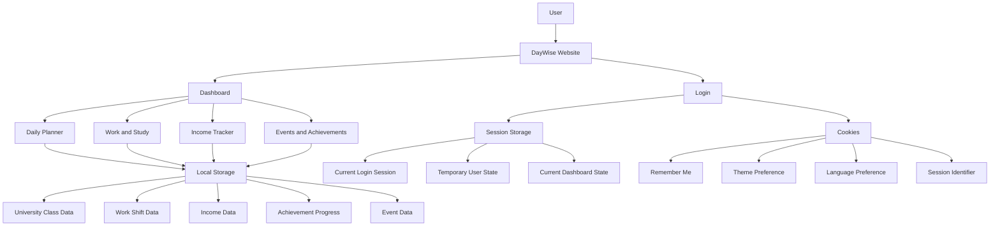
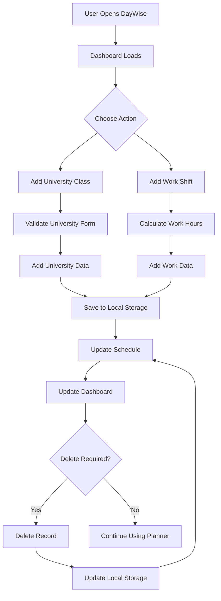

# DayWise – Work & Study Planner

## Project Overview

**DayWise** is a client-side web application designed to help users organise their university classes, work shifts, working hours, and reminders in one place.

The **Work & Study Planner** allows users to add, view, and delete university classes and work shifts. The dashboard automatically updates when information is added or deleted.

The application demonstrates important client-side web development concepts, including:

* HTML5
* CSS3
* JavaScript
* DOM manipulation
* Form handling
* Browser Local Storage
* Data processing
* Responsive web design
* Dynamic user interface updates

---

# Main Features

## 1. Dashboard

The dashboard provides users with a quick overview of their current university and work schedule.

It displays:

* Number of university classes
* Number of work shifts
* Total working hours
* University reminder

The dashboard is automatically updated whenever a university class or work shift is added or deleted.

### Example

| Dashboard Item |   Example |
| -------------- | --------: |
| University     | 3 Classes |
| Work           |  2 Shifts |
| Hours          |    16 hrs |
| Reminder       |    Monday |

---

## 2. University Class Planner

The **Add University Class** form allows users to record their university timetable.

The form collects:

* Module Name
* Lecturer
* Day
* Start Time
* End Time
* Room Number

After the form is submitted, the class is added to the university schedule and saved in the browser's Local Storage.

### Example University Schedule

| Module                  | Day       | Time          |
| ----------------------- | --------- | ------------- |
| Client Side Development | Monday    | 10:00 - 12:00 |
| Database Systems        | Wednesday | 13:00 - 15:00 |

Users can also delete a university class when it is no longer required.

---

## 3. Work Shift Planner

The **Add Work Shift** form allows users to record their work schedule.

The form collects:

* Company Name
* Job Role
* Work Day
* Start Time
* End Time
* Location

The application automatically calculates the number of hours worked using the start and end times.

### Example

```text
Start Time: 09:00
End Time:   13:30
Total:      4.5 hours
```

The calculated working hours are stored together with the work-shift information.

---

## 4. Work Hours Calculation

JavaScript is used to automatically calculate the duration of each work shift.

The `calculateHours()` function converts the start and end times into minutes and calculates the difference.

This means that users do not need to manually enter the number of hours worked.

```javascript
function calculateHours(start, end) {

    let s = start.split(":");
    let e = end.split(":");

    let startMinutes = Number(s[0]) * 60 + Number(s[1]);
    let endMinutes = Number(e[0]) * 60 + Number(e[1]);

    return (endMinutes - startMinutes) / 60;
}
```

For example, a shift from **09:00 to 13:30** produces:

```text
4.5 hours
```

---

# Data Storage

DayWise currently uses the browser's **Local Storage** to persist university and work data.

The application stores two main datasets:

```javascript
university
work
```

The following Local Storage methods are used:

```javascript
localStorage.setItem()
localStorage.getItem()
```

JavaScript objects are converted into JSON before being stored:

```javascript
JSON.stringify()
```

When the data is retrieved, JSON is converted back into JavaScript objects using:

```javascript
JSON.parse()
```

This allows university classes and work shifts to remain available after refreshing or reopening the webpage in the same browser.

---

# DayWise System & Data Storage Architecture

The following diagram represents the wider DayWise system architecture, including the storage technologies planned for different parts of the application.



## Storage Explanation

### Local Storage

Local Storage is **currently implemented** in the Work & Study module.

It is used to store:

* University classes
* Work shifts
* Calculated work hours

The data remains available after the page is refreshed or reopened in the same browser.

### Session Storage

Session Storage is included in the **overall DayWise architecture** for temporary session-related information.

Examples include:

* Current login session
* Temporary user state
* Current dashboard state

Session Storage is **not currently implemented in the Work & Study JavaScript**.

### Cookies

Cookies are included in the overall architecture for potential features such as:

* Remember Me
* Theme preference
* Language preference
* Session identifier

Cookies are **not currently implemented in the Work & Study module**.

### Implementation Note

The current Work & Study implementation specifically uses **Local Storage**.

Session Storage and Cookies are represented in the wider DayWise architecture as planned storage technologies for other parts of the system.

---

# Data Structure

University classes and work shifts are stored as JavaScript objects inside arrays.

## University Class Object

```javascript
{
    module: "Client Side Development",
    lecturer: "Dr. Smith",
    day: "Monday",
    start: "10:00",
    end: "12:00",
    room: "B201"
}
```

## Work Shift Object

```javascript
{
    company: "Tesco",
    role: "Customer Assistant",
    day: "Tuesday",
    start: "09:00",
    end: "13:30",
    location: "London",
    hours: 4.5
}
```

The objects are stored inside arrays:

```javascript
let university = [];
let work = [];
```

The arrays are then converted to JSON and saved to Local Storage.

---

# Delete Functionality

The application provides delete buttons for both university classes and work shifts.

When the user deletes a record, the application:

1. Removes the record from the relevant array.
2. Saves the updated data to Local Storage.
3. Refreshes the relevant schedule table.
4. Updates the dashboard.
5. Displays a confirmation message.

## Delete University Class

```javascript
university.splice(index, 1);

saveData();

displayUniversity();

updateDashboard();
```

## Delete Work Shift

```javascript
work.splice(index, 1);

saveData();

displayWork();

updateDashboard();
```

The `splice()` method removes the selected item from the relevant array.

---

# User Feedback

DayWise provides temporary notification messages when a user deletes a university class or work shift.

Examples:

```text
University class deleted.
```

```text
Work shift deleted.
```

The notification is displayed for approximately three seconds and then automatically disappears.

This functionality is implemented using JavaScript's `setTimeout()` function.

---

# Responsive Design

The application is designed to work across different screen sizes.

CSS media queries are used to adapt the layout for smaller screens.

### Desktop

* Dashboard cards use a responsive grid.
* University and work forms can appear side by side.
* University and work schedules can appear side by side.

### Smaller Screens

* Forms become a single-column layout.
* Schedule sections are displayed one below another.
* Navigation and headings adjust to fit smaller screens.

Example:

```css
@media(max-width:768px) {

    .forms,
    .lists {
        grid-template-columns: 1fr;
    }

}
```

---

# User Interface Design

The application uses a modern dark-themed interface.

Main design features include:

* Dark navy background
* Card-based dashboard
* Rounded containers
* Responsive grid layouts
* Yellow accent colour
* Hover animations
* Clear form labels
* Structured tables
* Consistent spacing
* Modern typography

The **Inter** font is used to provide a clean and modern appearance.

---

# Technologies Used

## HTML5

HTML is used to create the structure of the application, including:

* Header and navigation
* Dashboard cards
* University form
* Work form
* Input fields
* Select menus
* Schedule tables
* Buttons
* Notification area

## CSS3

CSS is used for:

* Page layout
* Colours
* Typography
* Cards
* Buttons
* Tables
* Hover effects
* Responsive design
* Media queries
* Animations

## JavaScript

JavaScript provides the main functionality of the Work & Study Planner, including:

* Form submission
* DOM manipulation
* Data storage
* Data retrieval
* Work-hour calculation
* Dashboard updates
* Dynamic table generation
* Delete functionality
* User notifications

## Browser Local Storage

Browser Local Storage is used to persist university and work schedule data.

This allows the data to remain available after the webpage is refreshed or reopened in the same browser.

---

# Project Structure

```text
DayWise/
│
├── workstudy.html
├── workstudy.css
├── workstudy.js
└── README.md
```

## workstudy.html

Contains the structure and content of the Work & Study Planner, including:

* Dashboard
* University form
* Work form
* University schedule
* Work schedule
* Notification area

## workstudy.css

Contains the visual styling, layout, responsive design, animations, colours, and typography.

## workstudy.js

Contains the application functionality, including:

* Data management
* Form handling
* Work-hour calculations
* Dashboard updates
* Table generation
* Delete functionality
* Local Storage

## README.md

Contains the project documentation, architecture, features, technologies, data storage, and implementation details.

---

# Application Workflow

The basic workflow of the Work & Study Planner is:



---

# Current CRUD Functionality

The Work & Study module currently provides the following data management operations:

| Operation | University    | Work          |
| --------- | ------------- | ------------- |
| Create    | Yes           | Yes           |
| Read      | Yes           | Yes           |
| Update    | Planned       | Planned       |
| Delete    | Yes           | Yes           |
| Storage   | Local Storage | Local Storage |

The current implementation supports:

* Adding records
* Viewing records
* Deleting records
* Persistent browser storage

Editing existing records is planned as a future improvement.

---

# Current Implementation Status

| Feature                     | Status      |
| --------------------------- | ----------- |
| University Class Creation   | Implemented |
| Work Shift Creation         | Implemented |
| University Schedule Display | Implemented |
| Work Schedule Display       | Implemented |
| Work-Hour Calculation       | Implemented |
| Dashboard Updates           | Implemented |
| Delete University Class     | Implemented |
| Delete Work Shift           | Implemented |
| Local Storage               | Implemented |
| Responsive Design           | Implemented |
| User Notifications          | Implemented |
| Edit/Update Records         | Planned     |
| Session Storage             | Planned     |
| Cookies                     | Planned     |

---

# Conclusion

DayWise provides a centralised solution for managing university and work schedules in one client-side web application.

The Work & Study Planner demonstrates practical use of **HTML, CSS, JavaScript, DOM manipulation, form handling, Local Storage, data processing, responsive design, and dynamic user interface updates**.

The current implementation provides the core functionality required to create, view, calculate, store, and delete university and work schedule information.

The wider DayWise architecture can be extended in the future with additional features such as **Session Storage, Cookies, record editing, authentication, income tracking, events, achievements, and daily planning**.
