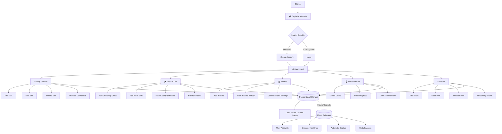

# System Architecture

```mermaid
graph TD

    %% User Access
    A[🌍 User] --> B[🏠 DayWise Website]

    %% Authentication
    B --> C{Login / Sign Up}

    C -->|New User| D[Create Account]
    C -->|Existing User| E[Login]

    D --> F[📊 Dashboard]
    E --> F

    %% Main Modules
    F --> G[📝 Daily Planner]
    F --> H[🎓 Work & Uni]
    F --> I[💰 Income]
    F --> J[🏆 Achievements]
    F --> K[📅 Events]

    %% Daily Planner
    G --> G1[Add Task]
    G --> G2[Edit Task]
    G --> G3[Delete Task]
    G --> G4[Mark as Completed]

    %% Work & Uni
    H --> H1[Add University Class]
    H --> H2[Add Work Shift]
    H --> H3[View Weekly Schedule]
    H --> H4[Set Reminders]

    %% Income
    I --> I1[Add Income]
    I --> I2[View Income History]
    I --> I3[Calculate Total Earnings]

    %% Achievements
    J --> J1[Create Goals]
    J --> J2[Track Progress]
    J --> J3[View Achievements]

    %% Events
    K --> K1[Add Event]
    K --> K2[Edit Event]
    K --> K3[Delete Event]
    K --> K4[Upcoming Events]

    %% Current Storage
    G --> L[(Browser Local Storage)]
    H --> L
    I --> L
    J --> L
    K --> L

    %% Load Saved Data
    L --> M[Load Saved Data on Startup]

    %% Future Upgrade
    L -. Future Upgrade .-> N[(Cloud Database)]

    %% Cloud Features
    N --> O[User Accounts]
    N --> P[Cross-device Sync]
    N --> Q[Automatic Backup]
    N --> R[Global Access]
```