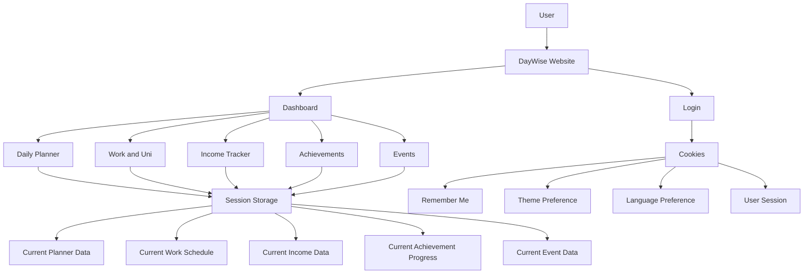

## DayWise System & Data Storage Architecture

```mermaid
graph TD

    A[User] --> B[DayWise Website]

    B --> C[Login]
    B --> D[Dashboard]

    D --> E[Daily Planner]
    D --> F[Work and Uni]
    D --> G[Income Tracker]
    D --> H[Achievements]
    D --> I[Events]

    %% Session Storage
    E --> J[Session Storage]
    F --> J
    G --> J
    H --> J
    I --> J

    J --> J1[Current Planner Data]
    J --> J2[Current Work Schedule]
    J --> J3[Current Income Data]
    J --> J4[Current Achievement Progress]
    J --> J5[Current Event Data]

    %% Cookies
    C --> K[Cookies]

    K --> K1[Remember Me]
    K --> K2[Theme Preference]
    K --> K3[Language Preference]
    K --> K4[User Session]
```
