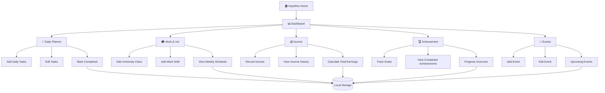

## Website Navigation Diagram

```mermaid
graph TD

    A[🏠 DayWise Home] --> B[📊 Dashboard]

    B --> C[📝 Daily Planner]
    B --> D[🎓 Work & Uni]
    B --> E[💰 Income]
    B --> F[🏆 Achievement]
    B --> G[📅 Events]

    C --> C1[Add Daily Tasks]
    C --> C2[Edit Tasks]
    C --> C3[Mark Completed]

    D --> D1[Add University Class]
    D --> D2[Add Work Shift]
    D --> D3[View Weekly Schedule]

    E --> E1[Record Income]
    E --> E2[View Income History]
    E --> E3[Calculate Total Earnings]

    F --> F1[Track Goals]
    F --> F2[View Completed Achievements]
    F --> F3[Progress Overview]

    G --> G1[Add Event]
    G --> G2[Edit Event]
    G --> G3[Upcoming Events]

    C3 --> H[(Local Storage)]
    D3 --> H
    E3 --> H
    F3 --> H
    G3 --> H
```